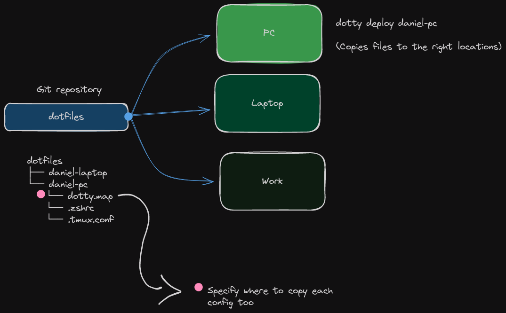

# Dotty

A very simple Dotfile manager!

- Manage dot files in one git repository
- Load dotfiles into a new profile
- Deploy dotfiles easily!

## Usage

### Install

```bash
> git clone https://github.com/Daniel-Const/dotty.git
> cd dotty
> mkdir bin/ && go build -o bin/
```

## Idea

The intention is for Dotty to be as simple as possible, easy to pickup and to leave more control
in users hands.

Dotty is based on profiles. You have one directory with all your machines config files / directories,
and a mapping file which specifies where those configs need to be copied to.

This way you can specify a profile for multiple different machines / operating systems that may have
slightly different configurations or destination paths

You can also create multiple profiles for one machine and easily switch between different configs to try
something new!

## Plan


